# Smoothie & Açaí Shop Online Ordering App

## Table of Contents

- [Smoothie \& Açaí Shop Online Ordering App](#smoothie--açaí-shop-online-ordering-app)
  - [Table of Contents](#table-of-contents)
  - [Project Overview](#project-overview)
  - [🎯 Purpose of the **Merry Berry Smoothie \& Açaí Shop** Project](#-purpose-of-the-merry-berry-smoothie--açaí-shop-project)
  - [🌟 Vision](#-vision)
  - [🏆 **Core Objectives:**](#-core-objectives)
    - [1. **Empower Healthy Eating:**](#1-empower-healthy-eating)
    - [2. **Provide a Seamless Digital Ordering Experience:**](#2-provide-a-seamless-digital-ordering-experience)
    - [3. **Efficient Order Management:**](#3-efficient-order-management)
    - [4. **Integration of Secure Payment Solutions:**](#4-integration-of-secure-payment-solutions)
    - [5. **Offer Personalisation and Flexibility:**](#5-offer-personalisation-and-flexibility)
    - [6. **Promote Customer Engagement:**](#6-promote-customer-engagement)
  - [Features](#features)
    - [🍓 Browse Menu](#-browse-menu)
    - [🥤 Customise Orders](#-customise-orders)
    - [🛒 Persistent Shopping Cart (Frontend Local storage)](#-persistent-shopping-cart-frontend-local-storage)
    - [🛍️ Order Management \& History](#️-order-management--history)
    - [📊 Real-Time Order Tracking](#-real-time-order-tracking)
    - [🔒 Secure Payment Processing](#-secure-payment-processing)
    - [💰 Promo Codes \& Discounts](#-promo-codes--discounts)
    - [⭐ User Reviews \& Ratings](#-user-reviews--ratings)
    - [🔐 Authentication (JWT \& OAuth2)](#-authentication-jwt--oauth2)
      - [**JWT Authentication**](#jwt-authentication)
      - [**OAuth2 Authentication**](#oauth2-authentication)
      - [**Secure Routes and Role-Based Access**](#secure-routes-and-role-based-access)
      - [**Logout:**](#logout)
      - [**Token Expiry \& Refresh Tokens**](#token-expiry--refresh-tokens)
      - [Summary of Authentication Features](#summary-of-authentication-features)
    - [📱 Responsive Design](#-responsive-design)
  - [🎯 **Target Audience**](#-target-audience)
    - [**👥 Health-Conscious Consumers 🥑**](#-health-conscious-consumers-)
    - [**👥 Fitness Enthusiasts \& Athletes 🏋️‍♂️**](#-fitness-enthusiasts--athletes-️️)
    - [**👥 Busy Professionals \& Students 📚**](#-busy-professionals--students-)
    - [**👥 Tech-Savvy Digital Shoppers 📱**](#-tech-savvy-digital-shoppers-)
    - [**👥 Local Community \& Regular Customers 🏡**](#-local-community--regular-customers-)
  - [Tech Stack](#tech-stack)
    - [Tech Stack Justification](#tech-stack-justification)
  - [🗺️ Dataflow Diagram: Visualising Data Flow within the Merry Berry System (Traditional DFD)](#️-dataflow-diagram-visualising-data-flow-within-the-merry-berry-system-traditional-dfd)
    - [🔑 Key Components of our Dataflow Diagram](#-key-components-of-our-dataflow-diagram)
      - [**Admin Functionality Dataflow Diagram Supplement**](#admin-functionality-dataflow-diagram-supplement)
        - [**Key Components of the Admin Functionality Dataflow Diagram:**](#key-components-of-the-admin-functionality-dataflow-diagram)
  - [🏗️ Application Architecture Diagram: Layered Structure for Scalability and Maintainability](#️-application-architecture-diagram-layered-structure-for-scalability-and-maintainability)
    - [📂 Layers of the Application Architecture](#-layers-of-the-application-architecture)
  - [User Stories: Persona-Driven Feature Development \& Refinement](#user-stories-persona-driven-feature-development--refinement)
  - [Persona 1: Emily - The Fitness-Focused Health Seeker](#persona-1-emily---the-fitness-focused-health-seeker)
    - [User Story 1: Browse Menu with Dietary Filters and Visual Appeal](#user-story-1-browse-menu-with-dietary-filters-and-visual-appeal)
      - [Revision History](#revision-history)
    - [User Story 2: Customise Orders for Personalised Nutrition](#user-story-2-customise-orders-for-personalised-nutrition)
    - [User Story 3: Track Order Status in Real-Time for Time Management](#user-story-3-track-order-status-in-real-time-for-time-management)
  - [Persona 2: John - The Busy Professional Seeking Quick \& Healthy Lunch](#persona-2-john---the-busy-professional-seeking-quick--healthy-lunch)
    - [User Story 4: Quick Reorder of Favorite Items for Lunchtime Efficiency](#user-story-4-quick-reorder-of-favorite-items-for-lunchtime-efficiency)
      - [Revision History](#revision-history-1)
    - [Persona 3: Maria - The Shop Owner Optimising Operations](#persona-3-maria---the-shop-owner-optimising-operations)
    - [User Story 5: Real-Time Order Management Dashboard for Operational Efficiency](#user-story-5-real-time-order-management-dashboard-for-operational-efficiency)
    - [Persona 4: Sarah - The First-Time App User Seeking Easy Onboarding](#persona-4-sarah---the-first-time-app-user-seeking-easy-onboarding)
    - [User Story 6: Interactive Onboarding Tutorial for Seamless First Experience](#user-story-6-interactive-onboarding-tutorial-for-seamless-first-experience)
    - [User Story 7: Visible Discounts and Promotions to Incentivise First Order](#user-story-7-visible-discounts-and-promotions-to-incentivise-first-order)
  - [🖼️ Wireframes: Demonstrating Iteration](#️-wireframes-demonstrating-iteration)
    - [Desktop Wireframes: Iteration Examples (Full Sets in `docs/wireframes/old` \& `docs/wireframes/new`)](#desktop-wireframes-iteration-examples-full-sets-in-docswireframesold--docswireframesnew)
      - [Home (Desktop) - Original vs. Revised](#home-desktop---original-vs-revised)
      - [Menu (Desktop) - Original vs. Revised](#menu-desktop---original-vs-revised)
    - [Mobile Wireframes: Iteration Examples (Full Sets in `docs/wireframes/old` \& `docs/wireframes/new`)](#mobile-wireframes-iteration-examples-full-sets-in-docswireframesold--docswireframesnew)
      - [Home (Mobile) - Original vs. Revised](#home-mobile---original-vs-revised)
      - [Menu (Mobile) - Original vs. Revised](#menu-mobile---original-vs-revised)
    - [Tablet Wireframes: Iteration Examples (Full Sets in `docs/wireframes/old` \& `docs/wireframes/new`)](#tablet-wireframes-iteration-examples-full-sets-in-docswireframesold--docswireframesnew)
      - [Home (Tablet) - Original vs. Revised](#home-tablet---original-vs-revised)
      - [Menu (Tablet) - Original vs. Revised](#menu-tablet---original-vs-revised)
  - [Git Workflow Using Git Flow](#git-workflow-using-git-flow)
    - [Main Branches](#main-branches)
    - [Supporting Branches](#supporting-branches)
    - [Workflow](#workflow)
  - [📌 GitHub Projects Board: Kanban for Agile Project Management \& Sprint Planning](#-github-projects-board-kanban-for-agile-project-management--sprint-planning)
    - [Screenshots (Throughout Part A Documentation):\*\*](#screenshots-throughout-part-a-documentation)
      - [Early Stage (Feb 9th)](#early-stage-feb-9th)
      - [Mid Stage (Feb 11th)](#mid-stage-feb-11th)
      - [Late Stage (Feb 13th)](#late-stage-feb-13th)
      - [Late Stage (Feb 15th)](#late-stage-feb-15th)
    - [📋 Kanban Board Standards: Clear, Simple, and Consistently Applied](#-kanban-board-standards-clear-simple-and-consistently-applied)
      - [✔️ Consistent Card Naming: `[Feature Area] - [Concise Task Description]`](#️-consistent-card-naming-feature-area---concise-task-description)
      - [✔️ Meaningful Label Usage: Categorisation, Priority, Workload](#️-meaningful-label-usage-categorisation-priority-workload)
      - [✔️ Clear Assignee Usage: Accountability](#️-clear-assignee-usage-accountability)
      - [✔️ Well-Defined Kanban Workflow: Progress Tracking](#️-well-defined-kanban-workflow-progress-tracking)
      - [✔️ Granular Checklists: Subtask Management](#️-granular-checklists-subtask-management)
    - [🗓️ Sprint Planning for Part B: Kanban-Informed Development Sprints](#️-sprint-planning-for-part-b-kanban-informed-development-sprints)
    - [🚀 Reflection: HD Project Management - Kanban Throughout \& Sprint-Ready](#-reflection-hd-project-management---kanban-throughout--sprint-ready)
      - [Kanban Board Overview](#kanban-board-overview)
      - [Issues List View](#issues-list-view)
      - [Example Issue Detail](#example-issue-detail)

## Project Overview

## 🎯 Purpose of the **Merry Berry Smoothie & Açaí Shop** Project

**Merry Berry Smoothie & Açaí Shop** is a full-stack solution designed to enhance the online ordering experience for health-conscious customers. The project’s main objective is to offer a platform where customers can easily browse, customise, order, and enjoy a variety of smoothies, açaí bowls, and other health-focused snacks—all with a few clicks. With this platform, we aim to provide not only delicious and nutritious options but also a smooth and user-friendly digital experience that simplifies the ordering process.

## 🌟 Vision

To become the leading online platform empowering healthy lifestyles by providing a seamless and delightful experience for ordering nutritious smoothies and açaí bowls, fostering a community of health-conscious individuals.

---

## 🏆 **Core Objectives:**

### 1. **Empower Healthy Eating:**

The primary goal of the project is to promote healthier food choices. By providing easy access to smoothies, açaí bowls, and other nutritious snacks, we are enabling customers to make better eating decisions and integrate healthy habits into their everyday lives.

### 2. **Provide a Seamless Digital Ordering Experience:**

The project is focused on creating a user-friendly digital platform where customers can explore menu items, customise orders, and track deliveries with minimal effort. Whether they are ordering on their phone, tablet, or desktop, the shopping experience is designed to be intuitive and responsive.

### 3. **Efficient Order Management:**

The project ensures a smooth and efficient order placement process. With a persistent shopping cart, real-time order tracking, and a robust order history feature, users can quickly review their past purchases and reorder with ease, fostering customer loyalty and satisfaction.

### 4. **Integration of Secure Payment Solutions:**

Ensuring the security of customer payments is a key focus. The project integrates **Stripe** for payment processing, ensuring safe and efficient transactions while providing various payment options like credit cards and digital wallets (Apple Pay, Google Pay).

### 5. **Offer Personalisation and Flexibility:**

Customers can personalise their orders by selecting their preferred sizes, toppings, and special instructions. This level of customisation allows for a tailored experience that meets individual tastes and dietary preferences.

### 6. **Promote Customer Engagement:**

By enabling user reviews and ratings, the project fosters a sense of community, where customers can share their experiences and provide valuable feedback on products. This helps to continuously improve the offerings and ensures customer satisfaction.

## Features

### 🍓 Browse Menu

**Feature:**
Enables customers to easily explore our offerings, directly supporting Objective 1 (Empower Healthy Eating) by showcasing the variety of healthy options. This is especially important for Health-Conscious Consumers and Busy Professionals who want to quickly see what's available.

**Details:**

- **Categories for Easy Navigation:** Products are grouped into categories like "Smoothies," "Açaí Bowls," and "Snacks" so customers can quickly find what they need.
- **High-Quality Images:** Each product includes a visually appealing image to help customers decide.
- **Detailed Descriptions:** Customers can view a list of ingredients and key benefits (e.g., "Rich in antioxidants").
- **Pricing Information:** Base price is clearly displayed, and additional costs (e.g., extra toppings) are shown before checkout.
- **Availability Status:** Only items that are currently in stock will be shown to customers.

### 🥤 Customise Orders

**Feature:**
Customers can personalise their orders based on preferences such as size, toppings, and special instructions before adding items to their cart.

**Details:**

- **Size Selection:** Some drinks may offer different sizes (Small, Medium, Large), with prices adjusting accordingly.
- **Topping Choices:** Customers can choose from a predefined list of toppings, such as chia seeds, honey, or protein powder, with pricing shown for each.
- **Special Instructions:** Customers can add free-text notes (e.g., "Less ice, please").

### 🛒 Persistent Shopping Cart (Frontend Local storage)

**Feature:**
Customers can dynamically build their cart, and the cart remains available even if they leave the page or refresh it.

**Details:**

- **Cart Stored on Frontend:** The cart is managed using React state and persisted in **local storage** instead of storing it in a database.
- **Persistence:** Even after a page refresh, the cart remains available because items are saved in **local storage**.

- **Real-Time Updates:** Users can:
  - Add items with customised options.
  - Remove individual items or clear the entire cart.
  - Modify existing items (e.g., changing the quantity or toppings).
- **Cart Summary:** Displays itemised costs, subtotal, and estimated total before checkout.

This ensures a seamless shopping experience, allowing users to retain their cart contents across sessions.

### 🛍️ Order Management & History

**Feature:**
Users can place orders and track their past purchases in their account dashboard.

**Details:**

- **Order Placement:** Once checkout is complete, the order is stored in the Orders Collection.
- **Order Details Stored:** Each order record contains:
  - Item names and quantities
  - Selected toppings or customisations
  - Total price paid
  - Order date and time
- **Order History:** Users can view all past orders and quickly reorder a previous purchase with one click.

### 📊 Real-Time Order Tracking

**Feature:**
After placing an order, users can track its status in real time.

**Details:**

- **Order Status Updates:** The system tracks an order through four key stages:
  - **Processing:** Order received and being prepared.
  - **In Progress:** Smoothie is being blended and packed.
  - **Ready for Pickup:** Order is completed and available at the store.
  - **Out for Delivery:** If delivery is enabled, customers receive real-time delivery updates.
- **Live Updates:** Users can refresh their order page or receive push notifications for updates.

### 🔒 Secure Payment Processing

**Feature:**
Customers can securely complete their purchases using a reliable third-party payment processor.

**Details:**

- **Stripe Integration:** Payments are handled via Stripe, ensuring safe and fast transactions.
- **Secure Checkout Flow:** Uses HTTPS encryption and tokenised payments to protect sensitive financial data.
- **Multiple Payment Methods:** Customers can pay using:
  - Credit or debit cards
  - Digital wallets (Apple Pay, Google Pay)
- **Order Confirmation:** After a successful transaction, users receive an email confirmation and receipt.

### 💰 Promo Codes & Discounts

**Feature:**
Customers can apply promo codes to receive discounts during checkout.

**Details:**

- **Discount Validation:** The system checks if a promo code is:
  - Valid (active within its start and end date).
  - Eligible for the cart total (e.g., a $10-off code might require a $50+ purchase).
  - Applicable to specific items (e.g., "Get 20% off all smoothies, but not snacks").
- **Automatic Discount Application:** If the promo code is valid, the system deducts the discount from the total price.
- **Error Handling:** If a code is invalid or expired, users get a clear message explaining why it cannot be applied.

### ⭐ User Reviews & Ratings

**Feature:**
Customers can leave feedback on menu items by submitting a star rating and written review.

**Details:**

- **Rating System:** Users can assign a 1 to 5-star rating to each menu item.
- **Review Submission:** Customers can provide comments on their experience (e.g., "Great smoothie, but a bit too sweet!").
- **Review Storage:** All reviews are stored in the Reviews Collection, linked to both:
  - The user who submitted the review
  - The menu item being reviewed
- **Public Visibility:** Reviews appear on the menu item’s page for other customers to see.

### 🔐 Authentication (JWT & OAuth2)

**Feature:**
Secure user authentication using JWT for stateless sessions and OAuth2 for third-party login integration.

**Details:**

#### **JWT Authentication**

- **User Registration:** New users can create an account by providing necessary information such as email, username, and password.
- **Login:** Existing users can log in using their username/email and password. Upon successful login, a **JWT token** is generated and sent back to the user.
  - The JWT token contains:
    - User information (e.g., user ID)
    - Expiration time
    - A secret key to verify the authenticity of the token.
- **Token Storage:** The token is stored in local storage or an HTTP-only cookie, depending on security requirements.
- **Token Validation:** For each subsequent request, the user sends the token in the HTTP Authorisation header as `Bearer <token>`. The backend validates the token, ensuring it's not expired or tampered with.
- **Secure Routes:** Routes requiring authentication (such as placing an order or viewing order history) check if the request includes a valid JWT token.

#### **OAuth2 Authentication**

- **Third-Party Login Integration:** Users can log in using their **Google**, **Facebook**, or other OAuth2-supported platforms.
- **OAuth2 Flow:** The application follows the standard OAuth2 authorisation flow:
  1. **Authorisation Request:** The user is redirected to the third-party platform’s login page.
  2. **Access Token Retrieval:** After the user logs in, the third-party platform redirects back to the application with an authorisation code, which is exchanged for an access token.
  3. **User Information:** The access token is used to request user information from the third-party platform’s API (such as name, email, etc.).
- **Token Handling:** The application stores the OAuth2 access token, either in local storage or session storage, to manage the user session.
- **Account Linking:** If the user already has an account, they can link their third-party OAuth2 login to their existing account for future logins.

#### **Secure Routes and Role-Based Access**

- **JWT Middleware:** The backend checks for a valid JWT token for any protected routes. If the token is invalid or expired, the user is denied access and asked to log in again.
- **Role-Based Access:** Users with different roles (e.g., admin, regular user) have access to different routes:
  - Admins can view and manage all orders and users.
  - Regular users can only view and manage their own orders.

#### **Logout:**

- **JWT Logout:** When the user logs out, the token is deleted from the local storage or invalidated by the backend if using a token blacklist.
- **OAuth2 Logout:** The user is logged out from the OAuth2 provider (e.g., Google) and their session is ended in the application.

#### **Token Expiry & Refresh Tokens**

- **Access Token Expiry:** JWT tokens typically have a short lifespan (e.g., 15 minutes). After expiration, the user must either log in again or use a **refresh token**.
- **Refresh Tokens:** A refresh token is issued alongside the access token and is used to obtain a new access token when the original expires.
  - Refresh tokens are stored securely and can be exchanged for a new access token by sending the refresh token to a secure endpoint.

---

#### Summary of Authentication Features

✔ **JWT Authentication** ensures stateless, secure sessions for users.  
✔ **OAuth2 Integration** allows third-party logins for easier user access.  
✔ **Token Expiry & Refresh** ensures a smooth user experience with minimal disruptions.  
✔ **Role-Based Access** secures the app by restricting routes based on user roles.

### 📱 Responsive Design

**Feature:**
The website is optimised for a seamless shopping experience across mobile, tablet, and desktop.

**Details:**

- **Flexible UI Components:** Uses Tailwind CSS to ensure a modern and responsive layout.
- **Mobile-First Approach:** Pages adapt to different screen sizes, with smooth navigation for smaller devices.
- **Touch-Friendly Elements:** Buttons and inputs are designed for easy tapping on touchscreens.

---

## 🎯 **Target Audience**

The **Merry Berry Smoothie & Açaí Shop** platform is tailored to meet the needs of a diverse customer base that values health, convenience, and digital accessibility. Below is a detailed breakdown of the target audience:

---

### **👥 Health-Conscious Consumers 🥑**

- Individuals committed to maintaining a healthy diet.
- People focused on balanced nutrition and natural ingredients.
- Those following dietary plans such as **vegan, keto, high-protein, or gluten-free**.

🎯 **Why They Need Merry Berry:**

- Access to **fresh, organic, and nutrient-rich** smoothies and bowls.
- Ability to customise orders based on dietary needs.
- Transparency in ingredients and nutritional benefits.

---

### **👥 Fitness Enthusiasts & Athletes 🏋️‍♂️**

- Gym-goers, runners, and sports professionals.
- Those seeking **high-protein, low-sugar, or energy-boosting** meal options.

🎯 **Why They Need Merry Berry:**

- **Post-workout recovery** smoothies with protein add-ons.
- Easily accessible **nutrient-dense snacks** to fuel workouts.
- Ability to track past orders and reorder their favorite blends.

---

### **👥 Busy Professionals & Students 📚**

- Office workers, entrepreneurs, and students with **hectic schedules**.
- People who prefer fast, **on-the-go** meals.

🎯 **Why They Need Merry Berry:**

- Quick ordering and **pickup-ready** meals.
- Mobile-friendly platform for **ordering during work/study breaks**.
- Secure payment processing for fast transactions.

---

### **👥 Tech-Savvy Digital Shoppers 📱**

- Consumers who prefer **online ordering over in-store purchases**.
- Millennials and Gen Z users who engage with brands digitally.

🎯 **Why They Need Merry Berry:**

- **User-friendly interface** with smooth browsing and checkout.
- **Real-time order tracking** and notifications.
- Multiple payment options, including **Apple Pay & Google Pay**.

---

### **👥 Local Community & Regular Customers 🏡**

- Customers who frequently visit smoothie and açaí bowl shops.
- Those who want a **personalised loyalty experience**.

🎯 **Why They Need Merry Berry:**

- **Order history & quick reorder** for favorite items.
- Access to **promo codes and discounts**.
- **In-store pickup & delivery tracking** for added convenience.

## Tech Stack

- **Front-end**: `React.js`
- **Back-end**: `Node.js & Express`
- **Database**: `MongoDB`
- **Design Tools**: `Figma`

### Tech Stack Justification

We have chosen `React.js` for the front-end to build a dynamic and responsive user interface, crucial for reaching our diverse target audience across devices.
`Node.js with Express` provides a scalable and efficient back-end, ideal for handling real-time order updates and secure transactions.
`MongoDB`'s NoSQL nature allows for flexible data schemas, accommodating the evolving needs of our menu and user data.
`Figma` was selected for collaborative and iterative wireframing and UI design.

## 🗺️ Dataflow Diagram: Visualising Data Flow within the Merry Berry System (Traditional DFD)

To comprehensively illustrate the flow of data within the Merry Berry Smoothie & Açaí Shop Online Ordering App, we are utilising a **Dataflow Diagram (DFD)**. This diagram adheres to standard DFD conventions to clearly depict the processes within our system, the external entities that interact with it, the data stores, and the flow of data between these components. This traditional DFD provides a clear and concise overview of the system's data handling, ensuring a strong understanding of data sources, destinations, and storage.

### 🔑 Key Components of our Dataflow Diagram

Our Dataflow Diagram explicitly identifies and depicts the following key components, adhering to standard DFD notation:

- **External Entities (Sources and Destinations of Data):** These are entities outside the system that either provide data to the system or receive data from it. In our DFD, we have:

  - **Alice (Customer):** Represented as a rectangle, Alice is the primary external entity interacting with the Merry Berry system. She initiates requests (e.g., Menu Item Request, Customisation Selections, Place Order Request, Order Tracking Request, Auth Request, Submit Review, View Reviews Request) and receives responses (e.g., Display Menu Items, Cart Update Confirmation, Order Confirmation, Order Status Updates, Auth Token [JWT], Review Submission Confirmation, Display Product Reviews).
  - **Payment Gateway (Stripe):** Represented as a rectangle, the Payment Gateway is an external system responsible for processing payments. Our system sends Payment Information to the Payment Gateway and receives Payment Data (Payment Status) in response.

- **Processes (Data Transformations):** Represented as circles, these are the actions or transformations performed by the system on the data. Our DFD includes the following key processes:

  - **Browse Menu Items:** This process handles the "Menu Item Request" from Alice. It retrieves menu data from the MongoDB data store and provides (Display Menu Items) back to Alice.
  - **Customise Order:** This process receives "Customisation Selections" from Alice and uses this input to manage order customisation details. It provides (Customised Item Options) back to Alice.
  - **Add to Cart:** This process handles the "Add Item to Cart Request" from Alice, updating the cart items. It sends (Cart Update Confirmation) back to Alice.
  - **View Cart:** This process handles the "View Cart Request" from Alice, retrieving cart details. It provides (Cart Items & Summary) back to Alice.
  - **Place Order:** This process handles the "Place Order Request" from Alice. It receives "Payment Information" and "Promo Code" data, interacts with the "Validate Promo Code" and "Process Payment" processes, and stores order details in the MongoDB data store. It sends (Order Confirmation) back to Alice.
  - **Validate Promo Code:** This process receives "Promo Code" data from the "Place Order" process. It retrieves promo codes from the MongoDB data store and provides (Validation Result) back to the "Place Order" process.
  - **Process Payment:** This process receives "Payment Information" from the "Place Order" process and interacts with the "Payment Gateway" to process the payment. It receives (Payment Status) from the "Payment Gateway" and provides (Payment Result) back to the "Place Order" process.
  - **Track Order Status:** This process handles the "Order Tracking Request" from Alice. It retrieves order status from the MongoDB data store and provides (Order Status Updates) back to Alice.
  - **User Authentication:** This process handles the "Auth Request [Login/Register]" from Alice, verifying user credentials against data in MongoDB. It provides (Auth Token [JWT]) back to Alice.
  - **Submit Review:** This process handles the "Submit Review & Rating" from Alice. It stores user reviews and ratings in the MongoDB data store and provides (Review Submission Confirmation) back to Alice.
  - **View Reviews:** This process handles the "View Reviews Request" from Alice. It retrieves product reviews from the MongoDB data store and provides (Display Product Reviews) back to Alice.

- **Data Store (Data at Rest):** Represented as an open-ended rectangle, this is where the system stores persistent data. In our DFD, we have:

  - **MongoDB Database:** This data store holds various collections including Menu Data, Order Details, Promo Codes, User Credentials, and User Reviews & Ratings. It serves as the central repository for the application's persistent data.

- **Data Flows (Data in Motion):** Represented as arrows, these indicate the movement of data between external entities, processes, and data stores. The arrows are labeled to clearly indicate the data being transferred. Examples include:

  - `Menu Item Request` (from Alice to "Browse Menu Items")
  - `Display Menu Items` (from "Browse Menu Items" to Alice)
  - `Retrieve Menu Data` (from "Browse Menu Items" and "Validate Promo Code" and "View Reviews" to MongoDB)
  - `Customisation Selections` (from Alice to "Customise Order")
  - `Cart Update Confirmation` (from "Add to Cart" to Alice)
  - `Get Cart Details` (from "View Cart" to "Add to Cart")
  - `Order Confirmation` (from "Place Order" to Alice)
  - `Payment Information` (from "Place Order" to "Process Payment")
  - `Payment Data` (from "Payment Gateway" to "Process Payment")
  - `Order Status Updates` (from "Track Order Status" to Alice)
  - `Auth Token [JWT]` (from "User Authentication" to Alice)
  - `Review Submission Confirmation` (from "Submit Review" to Alice)
  - `Display Product Reviews` (from "View Reviews" to Alice)
  - `Store Order Details` (from "Place Order" to MongoDB)
  - `Retrieve Promo Codes` (from "Validate Promo Code" to MongoDB)
  - `Store User Review & Rating` (from "Submit Review" to MongoDB)
  - `Verify User Credentials` (from "User Authentication" to MongoDB)
  - `Retrieve Order Status` (from "Track Order Status" to MongoDB)

#### **Admin Functionality Dataflow Diagram Supplement**

To further illustrate the data flow within the Merry Berry system, particularly for administrative functionalities, we have developed a supplemental Dataflow Diagram specifically focused on **Admin User interactions**. This diagram details the data flow involved in menu item management and order overview from an administrative perspective.

##### **Key Components of the Admin Functionality Dataflow Diagram:**

- **External Entities (Sources and Destinations of Data for Admin Functions):**

  - **ADMIN:** Represented as a green rectangle, the ADMIN entity represents the shop administrator or staff member responsible for managing the system's backend functionalities, specifically menu items and order overview. The ADMIN initiates actions related to menu management and order monitoring.

- **Processes (Data Transformations for Admin Functions):** Represented as purple circles, these processes detail the administrative actions and data transformations within the system:

  - **Verify User credential (JWT):** This process handles the authentication of the ADMIN user, verifying their credentials (JWT - JSON Web Token) to ensure they have the necessary administrative privileges to access protected functionalities. It receives "Admin Credentials for Verification" and provides "Admin Authentication Success / Failure" feedback.
  - **Verify admin role/permission:** Subsequent to successful authentication, this process validates the ADMIN user's role and permissions to ensure they are authorised to perform specific administrative actions (like menu updates or order management). It receives "Validating authorisation" requests and grants or denies access accordingly ("If granted, have access to").
  - **Display Order Details:** This process handles requests from the DASHBOARD UI to display detailed order information to the ADMIN. It receives "Request order summary" and provides "(Detailed Order Data)" to be displayed on the dashboard.
  - **Display Menu Items:** This process handles requests to display the menu item list for administrative review and management. It receives "GET Request Menu Item List" and provides "(Menu Item Data)" for display in the DASHBOARD UI.
  - **Update order status:** This process allows the ADMIN to manually update the status of an order. It receives "Initiate Order Management Action" and "Retrieve current order status" to facilitate order status updates.
  - **Fetch order status:** This process is responsible for retrieving the current status of orders, likely for display in the DASHBOARD UI or for order management purposes.
  - **Create Menu Item:** This process handles the creation of new menu items in the system. It receives "POST Request /menu-items" and "Initial Menu Update Action" from the DASHBOARD UI and interacts with the MongoDB data store to persist the new menu item.
  - **Update Existing Menu Item:** This process handles modifications to existing menu items. It receives "PATCH/PUT Request /menu-items/{id}" and "Initial Menu Update Action" from the DASHBOARD UI and interacts with the MongoDB data store to update the specified menu item.
  - **Delete Menu Item:** This process handles the removal of menu items from the system. It receives "DELETE Request /menu-items/{id}" and "Initial Menu Update Action" from the DASHBOARD UI and interacts with the MongoDB data store to delete the specified menu item.

- **Data Stores (Data at Rest for Admin Functions):**

  - **MongoDB:** The MongoDB data store, represented as a blue rectangle, persists data related to menu items and orders, which are managed and accessed through the administrative functionalities depicted in this DFD.

- **User Interface (Admin-Specific UI):** Represented as an orange rectangle:

  - **DASHBOARD UI:** This represents the administrative user interface, likely a web-based dashboard, used by the ADMIN to interact with the system, view order summaries, manage menu items, and initiate administrative actions. It sends requests such as "Request order summary," "GET Request Menu Item List," and "Initial Menu Update Action" and receives data to display.

- **Data Flows (Data in Motion for Admin Functions):**

  - `Admin Credentials for Verification` (from ADMIN to "Verify User credential (JWT)")
  - `Admin Authentication Success / Failure` (from "Verify User credential (JWT)" to Backend API Server)
  - `Validating authorisation` (from Backend API Server to "Verify admin role/permission")
  - `If granted, have access to` (from "Verify admin role/permission" to DASHBOARD UI)
  - `Request order summary` (from DASHBOARD UI to "Display Order Details")
  - `(Detailed Order Data)` (from "Display Order Details" to DASHBOARD UI)
  - `GET Request Menu Item List` (from DASHBOARD UI to "Display Menu Items")
  - `(Menu Item Data)` (from "Display Menu Items" to DASHBOARD UI)
  - `Initiate Order Management Action` (from DASHBOARD UI to "Update order status")
  - `Retrieve current order status` (from "Update order status" to "Fetch order status")
  - `POST Request /menu-items` (from DASHBOARD UI to "Create Menu Item")
  - `PATCH/PUT Request /menu-items/{id}` (from DASHBOARD UI to "Update Existing Menu Item")
  - `DELETE Request /menu-items/{id}` (from DASHBOARD UI to "Delete Menu Item")
  - Data flows between "Create Menu Item", "Update Existing Menu Item", "Delete Menu Item", "Display Menu Items", "Fetch order status" and `MongoDB` (implicitly representing data storage and retrieval operations, though specific labels are less detailed in this Admin DFD for conciseness).

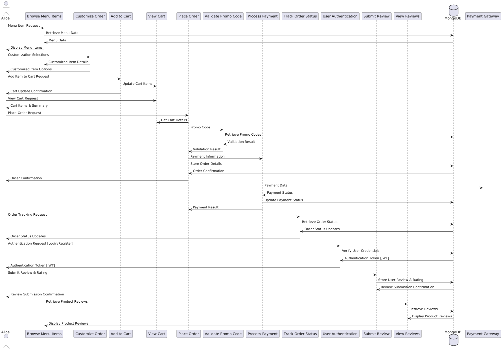
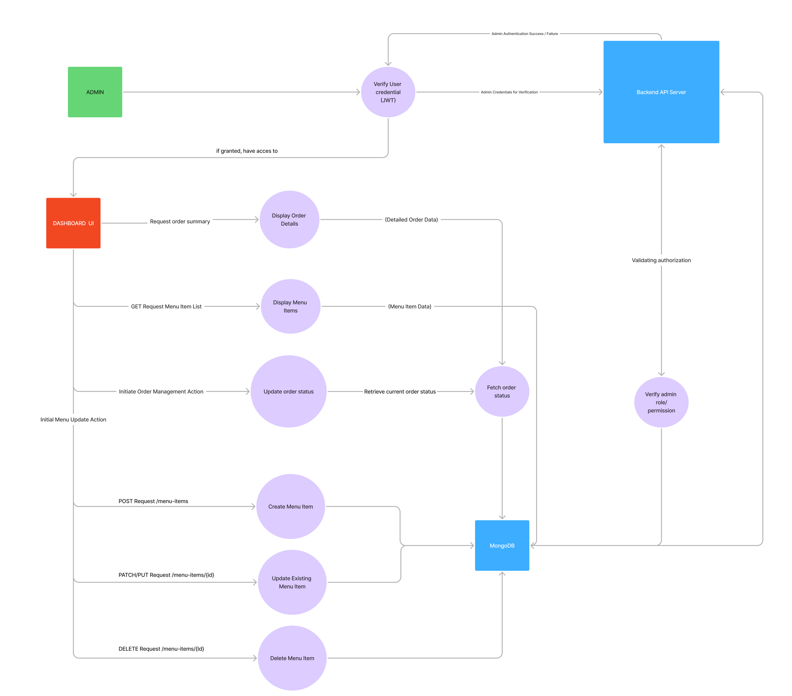

---

## 🏗️ Application Architecture Diagram: Layered Structure for Scalability and Maintainability

To illustrate the high-level structure and architectural design of the Merry Berry Smoothie & Açaí Shop application, we have created an Application Architecture Diagram (AAD). This diagram visually represents the layered architecture of our system, demonstrating a clear separation of concerns and our strategic approach to building a scalable, maintainable, and robust application. The AAD provides an "almost flawless" understanding of the application's structural organisation and component interactions.

### 📂 Layers of the Application Architecture

Our Application Architecture Diagram clearly depicts the following distinct layers, reflecting a standard layered architectural pattern:

- **Presentation Layer:** This layer is responsible for handling user interactions and presenting the user interface. As shown in the AAD, the **React.js Frontend** constitutes our Presentation Layer. It encompasses all React components, UI elements, and client-side logic responsible for rendering the user interface and handling user input.
- **Business Logic Layer (Application Layer):** This layer encapsulates the core application logic, business rules, and processing. In our architecture, the **Node.js & Express Backend** forms the Business Logic Layer. This layer houses our API endpoints, server-side logic for order processing, authentication, data validation, and interaction with the Data Access Layer. Key components within this layer include:
  - API Controllers (handling routes and requests)
  - Services (encapsulating business logic for specific features like order management, menu management, user authentication)
  - potentially Middleware (for authentication, request logging, etc.)
- **Data Access Layer:** This layer is responsible for managing data persistence and interaction with the database. The **MongoDB Database** and **Mongoose ORM** together constitute our Data Access Layer. Mongoose acts as an Object-Document Mapper, facilitating interaction with the MongoDB database. This layer handles database queries, data retrieval, and data storage operations.

The Application Architecture Diagram visually connects these layers and indicates the flow of requests and data between them. It demonstrates how the Presentation Layer (Frontend) interacts with the Business Logic Layer (Backend API), which in turn interacts with the Data Access Layer (MongoDB).

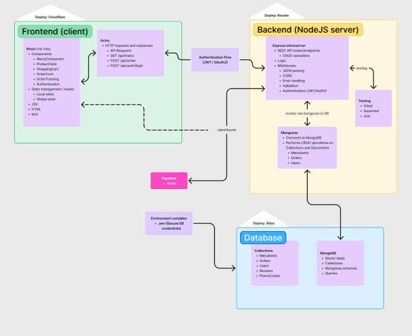

## User Stories: Persona-Driven Feature Development & Refinement

Our user stories are meticulously crafted to be persona-driven, ensuring that the Merry Berry Smoothie & Açaí Shop application is designed with the end-user firmly in mind. We have employed the ‘persona, what and why’ format for each user story to clearly articulate user needs and the rationale behind each feature. Furthermore, we have actively incorporated a process of revision and refinement based on simulated user feedback and usability considerations, demonstrating an iterative approach to feature definition.

## Persona 1: Emily - The Fitness-Focused Health Seeker

**Persona Description:** Emily, 28, is a dedicated fitness enthusiast living a busy, health-conscious lifestyle in the city. She works as a marketing professional and prioritises regular exercise and nutritious eating to maintain her energy levels and well-being. Emily is training for a half-marathon and is very conscious of her macronutrient intake, particularly post-workout protein and natural sugars. After intense gym sessions, she seeks quick, healthy, and customisable meal options that align with her fitness goals. She values efficiency and appreciates technology that simplifies her healthy lifestyle choices.

### User Story 1: Browse Menu with Dietary Filters and Visual Appeal

- **What:** As Emily, a **Fitness-Focused Health Seeker**, I want to easily browse the menu with distinct categories (smoothies, açaí bowls, toppings), dietary filters (vegan, gluten-free, high-protein, low-sugar), and high-quality images for each item.

- **Why:** So that **I can swiftly discover healthy and appealing options that perfectly fit my dietary needs and training regime, allowing me to make informed and efficient choices after my workouts without spending unnecessary time searching. Crucially, after an intense workout, my energy and focus are limited. A visually rich and well-organised menu acts as a mental shortcut, _reducing decision fatigue and enabling me to quickly identify and select nutritious choices that align with my fitness identity and goals._ I need to ensure the food I order supports my fitness goals and dietary preferences, and a visually rich, well-organised menu will help me do this quickly and effortlessly, minimising any barriers to healthy eating after exercise.**

#### Revision History

**Before (Initial User Story - Less Specific):**

> - **What:** As a health-conscious user, I want to browse the menu easily.
> - **Why:** So I can find healthy options.

**After (Revised User Story - Detailed & Persona-Focused):** _(Current User Story as above)_

**Revision Rationale:** Initial feedback indicated the user story was too generic and lacked specific details crucial for Emily's persona. Users pointed out that for a fitness-focused individual like Emily, _speed and ease of navigation are paramount post-workout due to potential fatigue_. The revised user story incorporates specific dietary filters and emphasises visual appeal and clear categorisation to directly address Emily's need for efficient and effortless healthy food discovery after exercise. The 'Why' section is significantly strengthened to highlight the _psychological benefit of reduced decision fatigue_ and alignment with her fitness identity, making the feature more impactful and user-centric.

### User Story 2: Customise Orders for Personalised Nutrition

- **What:** As Emily, a **Fitness-Focused Health Seeker**, I want to precisely customise my açaí bowl or smoothie to suit my specific nutritional requirements by easily adding or removing ingredients (like almond milk, various protein powders, specific fruits, seed types, etc.) and specifying portion sizes.

- **Why:** To ensure that **my purchase not only tastes fantastic but also perfectly aligns with my post-workout nutritional goals, allowing me to fine-tune the macronutrient profile (protein, carbohydrate, healthy fat content) to optimally support my training and recovery.** Precise customisation empowers me to take direct control of my nutrition. _For my half-marathon training, precise macronutrient ratios are critical for optimal performance and recovery. The ability to customise ensures that every smoothie or bowl becomes a targeted nutritional tool, maximizing the health benefits and directly contributing to my fitness progress. This level of personalisation moves beyond mere convenience; it's about actively supporting my athletic goals through informed dietary choices._

- **Revision:** Based on user input and Emily's persona needs, the customisation feature was significantly expanded to enable a wider range of dietary preferences and nutritional adjustments. Beyond the original three basic selections, we incorporated options for keto-friendly, low-sugar, and high-protein customisations, reflecting the diverse dietary needs of health-conscious users like Emily. We also improved the UI for customisation to be more intuitive and visually clear, making it easier for users to see the impact of their choices on the nutritional content of their order.

### User Story 3: Track Order Status in Real-Time for Time Management

- **What:** As Emily, a **Fitness-Focused Health Seeker**, I want to be able to track my order status in real-time, with clear updates on each stage (e.g., "Preparing," "Blending," "Ready for Pickup"), displayed with a progress bar and timely notifications.

- **Why:** To effectively plan my time after my workout and gym sessions, **allowing me to precisely time my arrival for pickup or anticipate delivery, avoid unnecessary waiting at the shop, and seamlessly integrate my healthy meal into my busy schedule without disrupting my workout routine or other commitments.** Knowing the exact order status gives me control and reduces stress in my time-constrained day. _Time is a precious commodity, especially when balancing work, training, and personal life. Real-time order tracking is not just about convenience; it's about respecting my schedule and minimising disruptions to my carefully planned day. By knowing exactly when my order will be ready, I can optimise my post-workout routine, ensuring I get my nutritious meal without unnecessary delays and can quickly move on to my next commitment._

## Persona 2: John - The Busy Professional Seeking Quick & Healthy Lunch

**Persona Description:** John, 35, is a busy marketing manager working long hours in a demanding corporate environment. He values convenience and efficiency, especially during his limited lunch breaks. John is increasingly health-conscious and wants to make better food choices but often struggles to find healthy options that are also quick and easy to access near his office. He appreciates streamlined digital experiences and relies heavily on mobile ordering for lunch.

### User Story 4: Quick Reorder of Favorite Items for Lunchtime Efficiency

- **What:** As John, a **Busy Professional Seeking Quick & Healthy Lunch**, I would like to be able to quickly reorder my favorite smoothie or açaí bowl combinations from my past order history with just a single click or tap, directly from the homepage or order history section.

- **Why:** To drastically save time during my short lunch breaks and ensure that **I can consistently get my preferred healthy and satisfying meal as quickly and effortlessly as possible, maximising my limited break time for relaxation and recharging before returning to work.** Reordering saves me from having to browse and customise my order each time, which is crucial when time is of the essence. _Lunch breaks are a critical, but often too short, window in my hectic workday. Every second saved during ordering translates to more precious moments to de-stress, recharge, and actually enjoy my healthy lunch. A one-click reorder feature is not just about convenience; it's about reclaiming valuable personal time and making my lunch break a true break, rather than a rushed and stressful transaction._

#### Revision History

**Before (Initial User Story - Less Emphatic 'Why'):**

> - **What:** As a busy professional, I want to reorder quickly.
> - **Why:** To save time during lunch.

**After (Revised User Story - Stronger 'Why' & Homepage Focus):** _(Current User Story as above)_

**Revision Rationale:** Initial feedback suggested that while the user story addressed John's need for speed, the 'Why' section could be more impactful and emotionally resonant. Users emphasised that for busy professionals, lunch breaks are not just about sustenance but also about _mental respite and stress reduction_. The revised user story strengthens the 'Why' to highlight the _value of reclaimed personal time during lunch breaks_ and the feature's role in making lunch a true break for John. Furthermore, based on usability considerations for frequent reordering, the revised user story explicitly requests the reorder functionality to be accessible directly from the _homepage_, making it even more efficient and prominent for users like John who prioritise speed and ease of access.

### Persona 3: Maria - The Shop Owner Optimising Operations

**Persona Description:** Maria, 40, is the owner and hands-on manager of the Merry Berry Smoothie & Açaí Shop, a thriving local business she built from the ground up. She is deeply passionate about providing healthy and delicious options to her community and takes pride in the quality and freshness of her ingredients. Maria is now focused on efficiently managing her shop's increasingly busy operations, especially with the growing volume of online orders. She needs tools to streamline order management, understand customer preferences to refine her menu and marketing, and ultimately ensure customer satisfaction and maintain profitability in a competitive market. Maria is tech-literate but prioritises practical, user-friendly solutions that directly improve her business efficiency and customer service.

### User Story 5: Real-Time Order Management Dashboard for Operational Efficiency

- **What:** As Maria, the **Shop Owner Optimising Operations**, I need a comprehensive and real-time dashboard that allows me to efficiently view and manage all incoming online orders, track their status, and prioritise them effectively. The dashboard should display key order details, customer notes, and order history.

- **Why:** To effectively prioritise and fulfill incoming orders in a timely manner, **enabling me to optimise my shop's operations, minimise customer wait times, reduce order errors, and ultimately increase customer satisfaction and repeat business. Real-time order visibility is crucial for efficient workflow management within my shop and ensuring smooth service during peak hours.** _My shop's success hinges on operational efficiency and customer happiness. A real-time dashboard is not just a tool for managing orders; it's the central nervous system of my online business. It empowers me to proactively manage workflow, anticipate bottlenecks during peak hours, and ensure every customer receives prompt and accurate service. This level of operational control directly translates to improved customer loyalty and a thriving business._

### Persona 4: Sarah - The First-Time App User Seeking Easy Onboarding

**Persona Description:** Sarah, 22, is a tech-savvy college student studying environmental science at a local university. She is actively exploring healthy food options in her area as she tries to adopt a more balanced and sustainable lifestyle. Sarah is very comfortable with mobile apps and online ordering, using them daily for various aspects of her life, from social media to food delivery. When trying a new app, especially for food ordering, she appreciates a smooth, intuitive, and visually appealing onboarding experience. Sarah is also budget-conscious, relying on student loans and part-time work, so she is always on the lookout for good value and any promotions or discounts, especially for first-time users.

### User Story 6: Interactive Onboarding Tutorial for Seamless First Experience

- **What:** As Sarah, a **First-Time App User Seeking Easy Onboarding**, I would need a brief, interactive tutorial that guides me through the key features of the app as soon as I launch it for the first time, showing me how to browse the menu, customise orders, and place my first order smoothly.

- **Why:** To quickly feel comfortable and confident using the app without needing to search for help or figure things out on my own, **ensuring a positive first impression and encouraging me to explore the app's features and place my first order without frustration. A good onboarding experience is essential for me to adopt a new app and become a regular user.** _In today's app-saturated market, first impressions are everything. A seamless onboarding experience is not just about teaching me how to use the app; it's about making me feel welcome and valued as a new user. If the initial experience is confusing or frustrating, I'm likely to abandon the app and move on. An interactive tutorial demonstrates a commitment to user-friendliness and significantly increases the likelihood of me becoming a loyal Merry Berry customer._

### User Story 7: Visible Discounts and Promotions to Incentivise First Order

- **What:** As Sarah, a **First-Time App User Seeking Easy Onboarding**, I would want to easily see any available promotions and discounts specifically for first-time users, displayed prominently when I first open the app or browse the menu.

- **Why:** To save money on my first order and feel like I'm getting good value as a new user, **incentivising me to place my first order and explore the app's offerings. As a budget-conscious student, discounts and promotions are a significant factor in my purchasing decisions, and clear visibility of these offers will encourage me to try Merry Berry.** _As a student, every dollar counts. Seeing a clear discount for first-time users is not just about saving money; it's a signal that Merry Berry values new customers and understands budget constraints. Prominent visibility of promotions makes me feel like I'm getting a good deal and significantly increases my motivation to try out the app and place my first order. It's a key factor in converting my initial interest into a concrete action._

---

**Feature Coverage and Completeness:** We have conducted a comprehensive review of our user stories to ensure they cover all key functionalities of the Merry Berry Smoothie & Açaí Shop application as outlined in the project objectives and features section. The user stories address core user workflows, including menu browsing, order customisation, cart management, order placement, order tracking, secure payment, promo code application, and user reviews. Furthermore, they also consider essential aspects like user authentication, responsive design, and operational needs of the shop owner. We are confident that these user stories provide a robust foundation for the development of a user-centered and feature-rich application.

## 🖼️ Wireframes: Demonstrating Iteration

**To showcase our iterative design process, this README provides examples of both *Original* and *Revised* wireframes for Home and Menu screens across desktop, mobile, and tablet.  The *complete sets* of Original wireframes are located in `docs/wireframes/old`, and the *Revised* wireframes are in `docs/wireframes/new`.  Reviewing both folders provides a full understanding of our design evolution.**

These wireframes are medium-fidelity and explicitly demonstrate our iterative design approach and exceptional planning, addressing: **project flow, structure, space distribution, content prioritisation, action clarity, navigation, and responsiveness across devices**, crucial for High Distinction.

### Desktop Wireframes: Iteration Examples (Full Sets in `docs/wireframes/old` & `docs/wireframes/new`)

#### Home (Desktop) - Original vs. Revised

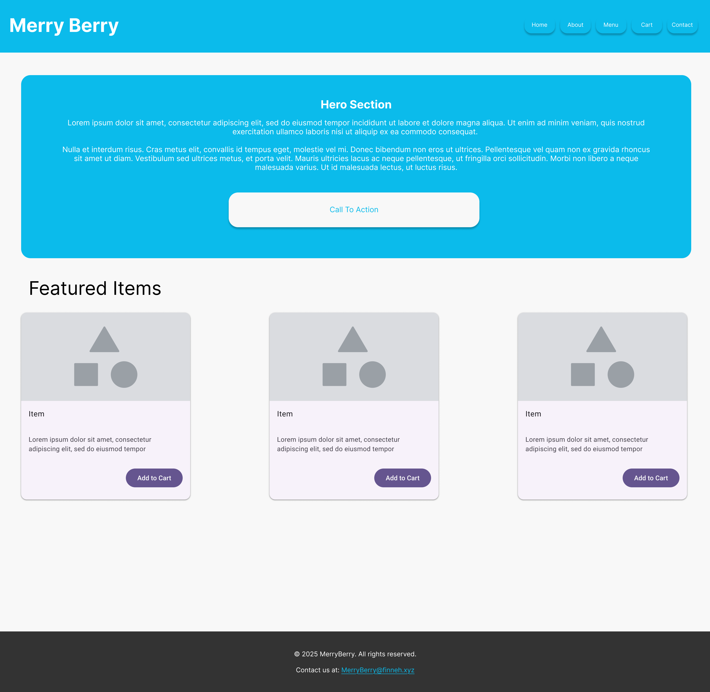
**Original Home (Desktop Example)**

**Revised Home (Desktop Example)**

*   **Iteration Highlight - Hero Section:**
    *   **Original:**  Basic hero section, generic placeholder text, less visually engaging.
    *   **Revised:**  Enhanced hero with more compelling layout, improved visual hierarchy within the section, clearer "Call To Action" button placement for better user guidance.  *Revision aimed for a more impactful first impression and clearer direction for the user.*
*   **Iteration Highlight - Featured Items:**
    *   **Original:** Simple list of "Featured Items" with basic layout.
    *   **Revised:** More visually distinct "Featured Items" section with improved spacing and visual separation, enhancing scannability and drawing more attention to featured products. *Revision focused on improving visual appeal and product discoverability.*

#### Menu (Desktop) - Original vs. Revised

[Insert **Original** Desktop Menu Wireframe Image (from `docs/wireframes/old`)]
**Original Menu (Desktop Example)**

[Insert **Revised** Desktop Menu Wireframe Image (from `docs/wireframes/new`)]
**Revised Menu (Desktop Example)**

*   **Iteration Highlight - Category Presentation:**
    *   **Original:** Basic category headings, menu items listed somewhat uniformly.
    *   **Revised:**  Visually clearer category separation and grouping, improved item spacing within categories for better readability and visual organisation. *Revision focused on enhancing menu structure and reducing visual clutter for easier browsing.*
*   **Iteration Highlight - "Details..." Links:**
    *   **Original:** Simple "Details..." links.
    *   **Revised:**  Slightly more visually distinct "Details..." links for improved discoverability and tap target size on touch-enabled desktops (if applicable), enhancing action clarity. *Revision focused on subtle UI improvements for usability.*

### Mobile Wireframes: Iteration Examples (Full Sets in `docs/wireframes/old` & `docs/wireframes/new`)

#### Home (Mobile) - Original vs. Revised

[Insert **Original** Mobile Home Wireframe Image (from `docs/wireframes/old`)]
**Original Home (Mobile Example)**

[Insert **Revised** Mobile Home Wireframe Image (from `docs/wireframes/new`)]
**Revised Home (Mobile Example)**

*   **Iteration Highlight - "Get Started" Section:**
    *   **Original:** Basic "Get Started" section, less prominent placement.
    *   **Revised:**  More prominent and visually distinct "Get Started" section, moved higher in the layout for increased visibility on mobile, stronger call to action. *Revision prioritised key action visibility on limited mobile screen space.*
*   **Iteration Highlight - Motivation Points:**
    *   **Original:** Simple stacked motivation points.
    *   **Revised:**  Improved visual styling of motivation points for better readability and visual engagement within the limited mobile viewport. *Revision focused on enhancing visual communication within constraints of mobile layout.*

#### Menu (Mobile) - Original vs. Revised

[Insert **Original** Mobile Menu Wireframe Image (from `docs/wireframes/old`)]
**Original Menu (Mobile Example)**

[Insert **Revised** Mobile Menu Wireframe Image (from `docs/wireframes/new`)]
**Revised Menu (Mobile Example)**

*   **Iteration Highlight - Item Spacing & Visual Grouping:**
    *   **Original:**  Menu items closely spaced, less visual separation.
    *   **Revised:**  Increased spacing between menu items and clearer visual grouping, improving readability and reducing visual density on the vertically scrolling mobile menu. *Revision focused on enhancing readability and scannability on mobile.*
*   **Iteration Highlight - Image Size (Subtle Adjustment):**
    *   **Original:**  Slightly larger images (potentially).
    *   **Revised:**  Minor adjustment to image size (potentially slightly smaller) for better balance with text content and improved vertical flow on mobile, optimising content density without compromising visual appeal. *Revision focused on fine-tuning image-to-text ratio for mobile context.*

### Tablet Wireframes: Iteration Examples (Full Sets in `docs/wireframes/old` & `docs/wireframes/new`)

#### Home (Tablet) - Original vs. Revised

[Insert **Original** Tablet Home Wireframe Image (from `docs/wireframes/old`)]
**Original Home (Tablet Example)**

[Insert **Revised** Tablet Home Wireframe Image (from `docs/wireframes/new`)]
**Revised Home (Tablet Example)**

*   **Iteration Highlight - Hero Section and Content Balance:**
    *   **Original:**  Tablet hero section possibly less distinct from desktop.
    *   **Revised:**  Refined tablet hero section to better leverage tablet screen size, potentially adjusting font sizes, spacing, or layout elements to be optimally viewed and interacted with on a tablet, creating a distinct tablet experience. *Revision focused on tailoring the hero section for the specific tablet context.*
*   **Iteration Highlight - "Featured Items" (Tablet Context):**
    *   **Original:** Tablet featured items layout potentially similar to desktop.
    *   **Revised:**  Adjusted "Featured Items" layout for tablet, potentially using a slightly modified grid or carousel to better suit tablet touch interaction and screen dimensions, enhancing user engagement on tablets. *Revision aimed at optimizing "Featured Items" for tablet interaction.*

#### Menu (Tablet) - Original vs. Revised

[Insert **Original** Tablet Menu Wireframe Image (from `docs/wireframes/old`)]
**Original Menu (Tablet Example)**

[Insert **Revised** Tablet Menu Wireframe Image (from `docs/wireframes/new`)]
**Revised Menu (Tablet Example)**

*   **Iteration Highlight - Grid Structure Refinement (Tablet):**
    *   **Original:** Tablet menu grid potentially less optimised for touch.
    *   **Revised:**  Refined tablet menu grid structure, potentially adjusting column count, item spacing, and touch target sizes to be ideally suited for tablet touch interaction, ensuring comfortable and efficient menu browsing on tablets. *Revision focused on touch optimisation for tablet menu.*
*   **Iteration Highlight - Visual Hierarchy & Element Sizing (Tablet):**
    *   **Original:** Tablet visual hierarchy potentially less distinct.
    *   **Revised:**  Fine-tuned visual hierarchy and element sizing (images, text, links) within tablet menu items to create a more visually appealing and easily scannable menu experience on tablet screens, enhancing overall tablet usability and aesthetics. *Revision aimed at improving visual appeal and scannability specifically for tablet users.*

---

**This iterative wireframing process, with Original and Revised examples shown above and full sets in `docs/wireframes/old` and `docs/wireframes/new` respectively, clearly demonstrates our commitment to exceptional planning and continuous refinement of our UI/UX design for the Merry Berry application, ensuring a user-centred and responsive experience across all devices.**

## Git Workflow Using Git Flow

The Git Flow workflow is used to manage source code, branching, and releases. Here's a description of the workflow:

### Main Branches

**main:** This branch contains the official release history.
**develop:** This is the main development branch from where all feature branches are branched from.

### Supporting Branches

**feature:** Feature branches are created for each new feature or task. They are branched from develop and merged back into develop after completion.
**release:** Release branches are created to prepare for a new release. They are branched from develop and merged into main and develop after release.
**hotfix:** Hotfix branches are created to fix bugs in production. They are branched from main and merged back into main and develop after the fix.

### Workflow

- New features are developed on feature branches branched from the develop branch.
- Once completed, feature branches are merged back into the develop branch.
- When ready for release, a release branch is created from the develop branch.
- After testing, the release branch is merged into the main branch, and also back into develop.
- If a bug is found in the main branch, it is addressed by creating a hotfix branch.
- After the bug is fixed, the hotfix branch is merged into main and also develop.

- **Version Control:** Git is used for version control, and all code changes are made using commits and pull requests.
- **Team Collaboration:** Git workflow provides a structured way for all team members to collaborate efficiently on the project.
- **Source Control:** This workflow ensures proper source control methodology and maintains a clean and organised project.
- **Branching Strategy:** Using a structured branching strategy like Git Flow helps manage code, facilitate collaboration, and ensure a stable and well maintained repository.

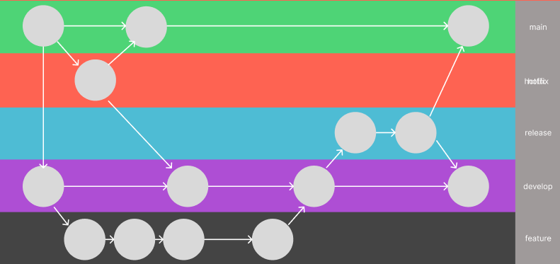

## 📌 GitHub Projects Board: Kanban for Agile Project Management & Sprint Planning

To ensure efficient project tracking and agile preparation for Part B, we utilise a Kanban-style GitHub Projects board, central to visualising workflow and managing tasks throughout the Merry Berry project. We consistently adhere to **simple and clear Kanban standards**, evidenced in the dated screenshots below, which also illustrate our sprint planning for Part B development.

### Screenshots (Throughout Part A Documentation):\*\*

#### Early Stage (Feb 9th)

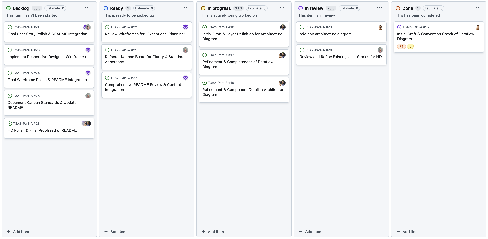

#### Mid Stage (Feb 11th)

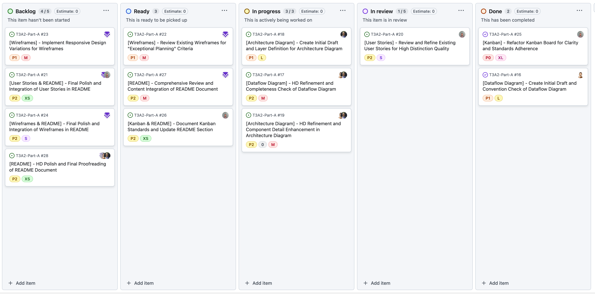

#### Late Stage (Feb 13th)

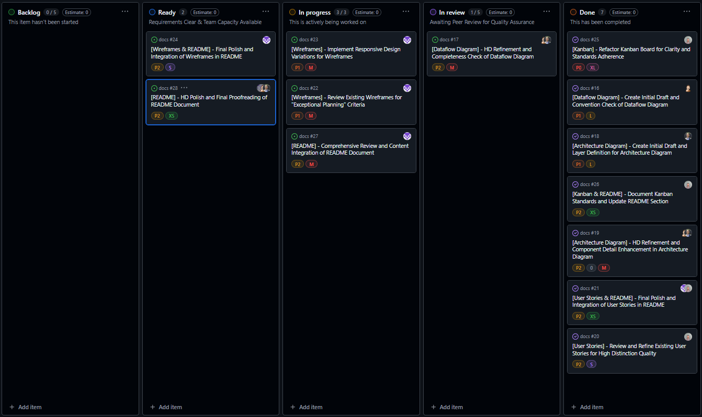

#### Late Stage (Feb 15th)

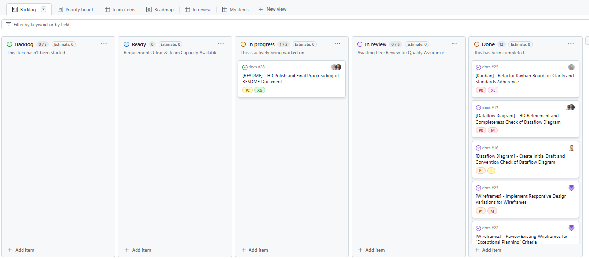

These screenshots, alongside the following standards, demonstrate our organised Kanban approach and Part B sprint planning.

### 📋 Kanban Board Standards: Clear, Simple, and Consistently Applied

Our GitHub Projects board adheres to these key standards:

#### ✔️ Consistent Card Naming: `[Feature Area] - [Concise Task Description]`

Uniform card naming using `[Feature Area] - [Concise Task Description]` (e.g., `[README] - HD Polish & Proofread`) ensures immediate task identification and categorisation, as shown in the **"Issues List View" screenshot**.

#### ✔️ Meaningful Label Usage: Categorisation, Priority, Workload

Diverse labels categorise tasks for clarity:

- **Documentation Type:** `Wireframes`, `User Stories`, `AAD`, `DFD`, `Kanban`, `README` (visually categorised in **"Issues List View" screenshot**).
- **Priority:** `Urgent` (`P0`), `High` (`P1`), `Medium` (`P2`) (priority labels in **"Kanban Board Overview" screenshots**).
- **Size Estimate:** `XS`, `S`, `M`, `L`, `XL` (for workload awareness).

**The "Issues List View" screenshot effectively showcases this varied and meaningful label application.**

#### ✔️ Clear Assignee Usage: Accountability

Each task is assigned to a team member for accountability, clearly visible by avatars in **"Kanban Board Overview" screenshots** within "In progress" and "In review" columns.

#### ✔️ Well-Defined Kanban Workflow: Progress Tracking

Workflow columns track task status:

- **Backlog:** Prioritised tasks (P0-P2 labels), ready for "Ready".
- **Ready: Requirements Clear & Capacity Available:** Queue for "In progress".
- **In progress:** Tasks actively being worked on.
- **In review: Awaiting Quality Assurance Review.**
- **Done:** Completed, reviewed tasks.

**"Kanban Board Overview" screenshots demonstrate tasks moving through these workflow stages throughout Part A.** Column descriptions on our live board further clarify each stage (e.g., "Ready: Requirements Clear & Capacity Available").

#### ✔️ Granular Checklists: Subtask Management

Checklists within Issue cards break down complex tasks into sub-steps, exemplified in the **"Example Issue Detail" screenshot**.

### 🗓️ Sprint Planning for Part B: Kanban-Informed Development Sprints

Extending Kanban, we planned Part B sprints around client/server milestones. Sprints are timeboxed (e.g., 1-week), iterative, and goal-focused. **Example: Backend Sprint 1 (Core API & Database Setup):**

- **Goal:** Establish foundational backend.
- **Tasks (from Kanban Backlog):**
  - `[Backend] - Set up Backend Project & MongoDB Database` ([Team Member])
  - `[Backend] - Implement User Model & Auth API` ([Team Member])
  - `[Database] - Design MongoDB Schemas (User, Menu)` ([Team Member])

Sprint backlogs are created by selecting prioritised tasks from Kanban "Backlog," utilising priority and size labels for delegation.

### 🚀 Reflection: HD Project Management - Kanban Throughout & Sprint-Ready

Our Kanban board, evidenced by dated screenshots, demonstrates consistently applied, simple and clear standards for HD project management throughout Part A and informs our sprint-based approach for Part B. This agile methodology ensures transparency, accountability, and organised progress from documentation to development.

#### Kanban Board Overview

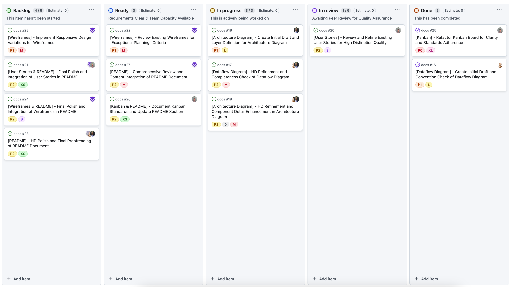

#### Issues List View

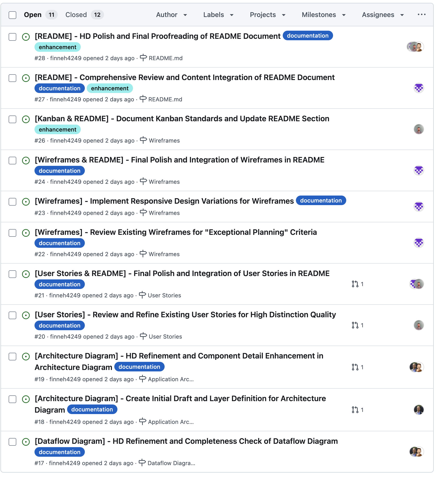

#### Example Issue Detail

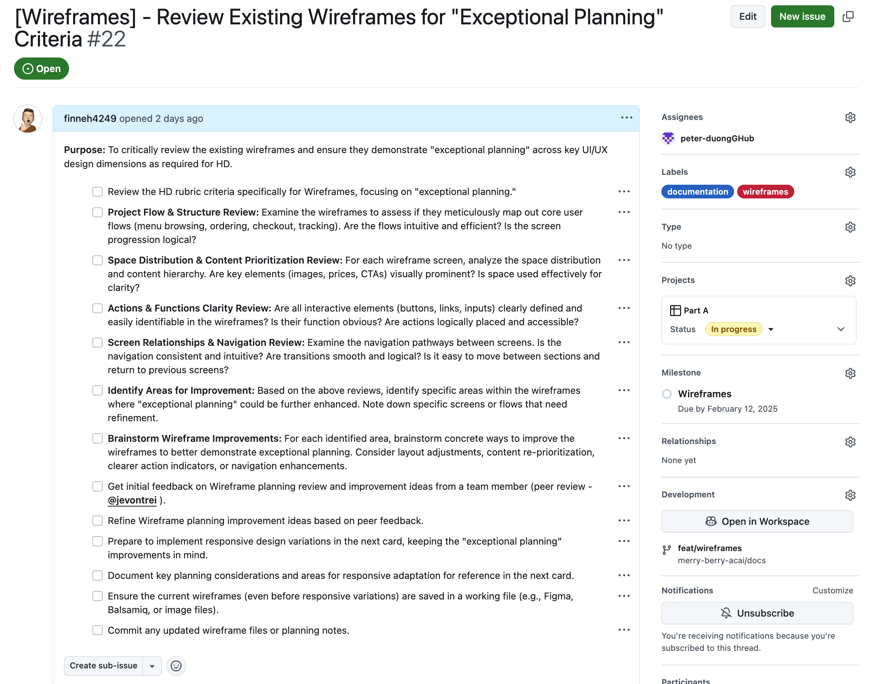
