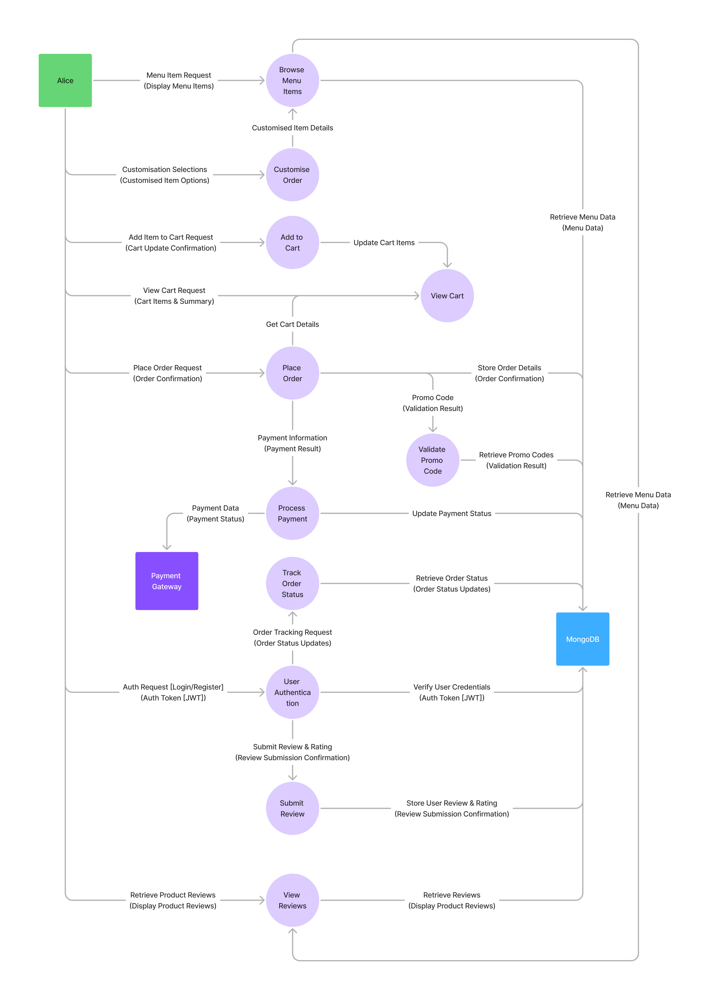

# Smoothie & Açaí Shop Online Ordering App

## Table of Contents

- [Smoothie \& Açaí Shop Online Ordering App](#smoothie--açaí-shop-online-ordering-app)
  - [Table of Contents](#table-of-contents)
  - [Project Overview](#project-overview)
    - [Tech Stack](#tech-stack)
  - [Dataflow Diagram](#dataflow-diagram)
  - [Application Architecture](#application-architecture)
    - [Presentation Layer](#presentation-layer)
    - [Business Logic Layer](#business-logic-layer)
    - [Data Access Layer](#data-access-layer)
  - [User Stories](#user-stories)
    - [Customer Perspective](#customer-perspective)
    - [Shop Owner Perspective](#shop-owner-perspective)
  - [Customer Flow](#customer-flow)
  - [Wireframes](#wireframes)
    - [Screenshots](#screenshots)
  - [Git Workflow Using Git Flow](#git-workflow-using-git-flow)
    - [Main Branches](#main-branches)
    - [Supporting Branches](#supporting-branches)
    - [Workflow](#workflow)
  - [Trello Board](#trello-board)
    - [Board Structure](#board-structure)

## Project Overview

The Smoothie & Açaí Shop Online Ordering App aims to enhance customer experience and streamline operations for a health-focused retail business. The app provides a user-friendly platform for customers to browse menus, customise orders, and track their orders, while offering efficient management tools for shop owners.

### Tech Stack

- **Front-end**: React.js
- **Back-end**: Node.js & Express
- **Database**: MongoDB
- **Design Tools**: Figma

## 🗺️ Dataflow Diagram: Visualizing Data Flow as a User Journey in the Merry Berry System

To comprehensively illustrate the flow of data within the Merry Berry Smoothie & Açaí Shop Online Ordering App, we have chosen to represent the data flow using a **Sequence Diagram**.  While traditional Dataflow Diagrams (DFDs) often focus on processes and data stores in a static manner, we believe a Sequence Diagram provides a more insightful and user-centric visualization for this application. Our Sequence Diagram effectively demonstrates the **step-by-step user journey** through the online ordering process, clearly showing the **sequence of data exchanges** that occur between the Customer and various system components.  This approach allows for a dynamic understanding of data flow within the application's key workflows, ensuring data integrity and a seamless user experience.

### 🔑 Key Components of our Sequence Diagram for Data Flow

Our Sequence Diagram explicitly identifies and depicts the following key components, adapted to represent data flow within a sequential interaction model:

*   **Participants:** In our Sequence Diagram, **Participants** represent the key actors and components involved in the data flow. These correspond to elements typically found in a DFD, but are visualized in terms of their interaction sequence:
    *   **Customer (Alice):** Representing the user interacting with the Merry Berry application, initiating requests and receiving data. This aligns with the **External Entity** concept in traditional DFDs.
    *   **Browse Menu Items, Customize Order, Add to Cart, View Cart, Place Order, Validate Promo Code, Process Payment, Track Order Status, User Authentication, Submit Review, View Reviews:** These **Participants** represent the **Processes** within the Merry Berry system that handle specific actions and data transformations during the user journey.
    *   **MongoDB Database:** Represented as a **Participant**, this signifies the **Data Store** where data is persisted and retrieved throughout the application's operation.
    *   **Payment Gateway (Stripe):**  Also a **Participant**, representing the **External Entity** responsible for handling payment processing outside of our core system.

*   **Messages:**  **Messages** in our Sequence Diagram illustrate the **Data Flows** between Participants. Each message, represented by an arrow, is clearly labeled to indicate the specific data being transferred or the action being initiated.  These messages demonstrate how data moves sequentially through the system as the user progresses through the ordering process. Examples include:
    *   `Menu Item Request`: A message from the Customer to the `Browse Menu Items` process, initiating the retrieval of menu data.
    *   `Retrieve Menu Data`: A message from the `Browse Menu Items` process to the `MongoDB Database`, demonstrating data retrieval from the data store.
    *   `Customization Selections`: A message from the Customer to the `Customize Order` process, carrying the user's choices for order modifications.
    *   `Payment Information`: A message from the `Place Order` process to the `Process Payment` process, transferring sensitive payment details for transaction handling.
    *   `Order Status Updates`: A message from the `Track Order Status` process back to the Customer, providing real-time order progress information.

The complete Sequence Diagram, visually representing these Participants and Messages in a chronological flow, is available as a separate image file in the [`docs/diagrams/`](./docs/diagrams/) directory, named `dataflow_diagram.png`. This diagram provides a detailed and user-journey-centric view of data movement within the Merry Berry application, effectively illustrating data flow through sequential interactions.

## Application Architecture

The Application Architecture Diagram (AAD) illustrates the different components of the application and how they interact. The application follows a layered architecture to ensure a separation of concerns and scalability. Here's a detailed explanation:

### Presentation Layer

This layer is the front-end of the application, built with React.js.
It handles user interface and user experience.
It is responsible for displaying information and receiving user inputs.

### Business Logic Layer

This layer is the back-end of the application, built using Node.js and Express.
It manages the core functionality of the application.
It handles data validation, processing, and interaction with the data access layer.

### Data Access Layer

- This layer manages how data is stored and retrieved from the database.
- It uses MongoDB to store the data with Mongoose as the Object Relational Mapper (ORM).
- It is responsible for handling database operations such as CRUD (Create, Read, Update, Delete).

[Insert Diagram Here]

## User Stories

Categorised by user roles, these stories highlight key functionalities.

### Customer Perspective

- As a customer, I want to browse the menu to explore available smoothies and açaí bowls.
- As a customer, I want to customise my order to include specific add-ons.
- As a customer, I want to track my order status to know when it's ready.

### Shop Owner Perspective

- As a shop owner, I want to manage menu items to update prices and descriptions.
- As a shop owner, I want to view sales reports to analyse revenue trends.

## Customer Flow

The sequence of actions taken by a customer to engage with the web application.

## Wireframes

Visual designs for key app screens ensure an intuitive user experience.

### Screenshots

1. **Menu Browsing**
2. **Order Customisation**
3. **Checkout Process**
4. **Order Tracking**

## Git Workflow Using Git Flow

The Git Flow workflow is used to manage source code, branching, and releases. Here's a description of the workflow:

### Main Branches

**main:** This branch contains the official release history.
**develop:** This is the main development branch from where all feature branches are branched from.

### Supporting Branches

**feature:** Feature branches are created for each new feature or task. They are branched from develop and merged back into develop after completion.
**release:** Release branches are created to prepare for a new release. They are branched from develop and merged into main and develop after release.
**hotfix:** Hotfix branches are created to fix bugs in production. They are branched from main and merged back into main and develop after the fix.

### Workflow

- New features are developed on feature branches branched from the develop branch.
- Once completed, feature branches are merged back into the develop branch.
- When ready for release, a release branch is created from the develop branch.
- After testing, the release branch is merged into the main branch, and also back into develop.
- If a bug is found in the main branch, it is addressed by creating a hotfix branch.
- After the bug is fixed, the hotfix branch is merged into main and also develop.

- **Version Control:** Git is used for version control, and all code changes are made using commits and pull requests.
- **Team Collaboration:** Git workflow provides a structured way for all team members to collaborate efficiently on the project.
- **Source Control:** This workflow ensures proper source control methodology and maintains a clean and organised project.
- **Branching Strategy:** Using a structured branching strategy like Git Flow helps manage code, facilitate collaboration, and ensure a stable and well maintained repository.

## Trello Board

Organised task management using Trello demonstrates efficient project tracking.

### Board Structure

- Lists: To Do, In Progress, Testing, Done
- Cards: Feature tasks (e.g., "Implement menu browsing")

[Insert Screenshots Here]
